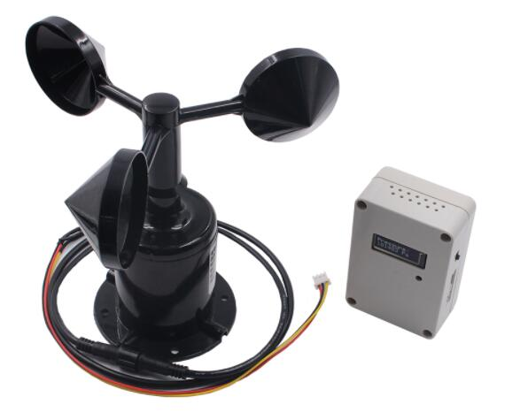
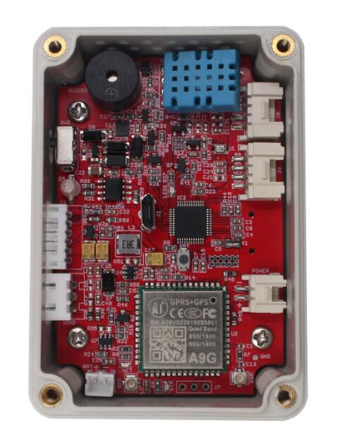
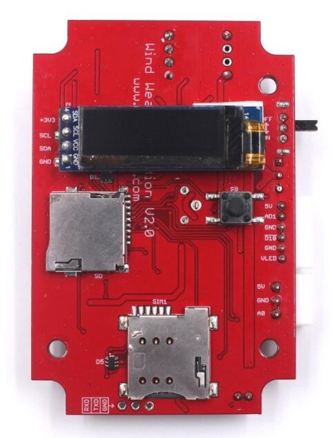
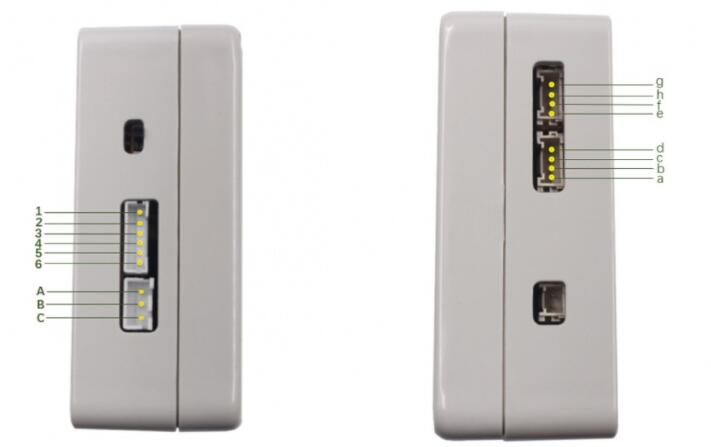
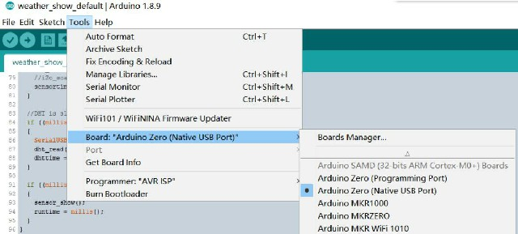

# Wind Weather Station

```c++
/*
Version:		V1.1
Author:			Vincent
Create Date:	2021/2/23
Note:
	2021/5/5:Add Seeed UV Sensor example.
	
*/
```
[toc]



[DIY Wind Weather Station and Remote Monitor via MQTT](https://www.youtube.com/watch?v=OUKzvni5h78)

# Makerfabs

[Makerfabs home page](https://www.makerfabs.com/)

[Makerfabs Wiki](https://makerfabs.com/wiki/index.php?title=Main_Page)

# Wind Weather Station

## Intruduce

Weather station based on Maduino A9G.With onboard DHT11 temperature and humidity sensor, BMP280 air pressure sensor and SSD1306LCD screen.It can be connected with anemometer and PM2.5 air quality sensor.

## Feature

- Micro controller ATSAMD21G18, 32-Bit ARM Cortex M0+
- PM2.5 monitoring with expanded PM2.5 sensor
- GPS for locating
- Grove connectors for customers’ expanded testing
- OLED display for real-time checking& debugging
- Onboard buzzer/ SD card slot
- High-power 1000 mAH battery for long-term usage
- Solar panel charging
- With Case(but not water-proof), could be re-made for water-proof with glues easily
- Arduino compatible/ Support MQTT

### Front:



### Back:


### Interface:



1. Interface of anemometer
|   Pin   |   Mark   |   Definition   |
| ---- | ---- | ---- |
|   A   |   VCC   |   Power supply   |
|   B   |   GND   |   Grounding   |
|   C   |   A0   |    Data input  |

2. Interface of CO2 sensor

| Pin| 	Mark	|Definition                |
| ---- | ---- | ---- |
|   1   |   5V   |   Power supply   |
|   2   |   AD1   |  Data input    |
|   3   |   GND   |  Grounding    |
|   4   |   D10   |  LED Driving    |
|   5   |   GND   |  LED grounding    |
|   6   |   VLED   | LED Power supply     |

3. Other interfaces

| Pin| 	Mark	|Definition                |
| ---- | ---- | ---- |
|   a   |      | GND |
|   b   |      | VCC |
| c |      | A5 |
| d |      | A4 |
| e |      | GND |
| f | | VCC |
| g |      | SDA |
| h |      | SCL |


# Example

## Compiler Options



Choice Arduino Zero (Native USB Port).

## weather_show_default

Factory default program, collect temperature, humidity, air pressure, wind speed, PM2.5 index, the sensor data display on SSD1306.

- Connect anemometer or air quality sensor (or both) to weather station.
- Connect to battery or USB cable.
- LCD screen will show sensor value.

## at_demo

A simple AT directive demo is provided.

## weather_MQTT

A simple example of MQTT communication. Data is sent by MQTT protocol through A9G module. Need a SIM card that can be connected to the Internet.

## low_power

A simple low-power test program that turns off power to the A9G and all sensors and puts the SAMD21 to sleep.

